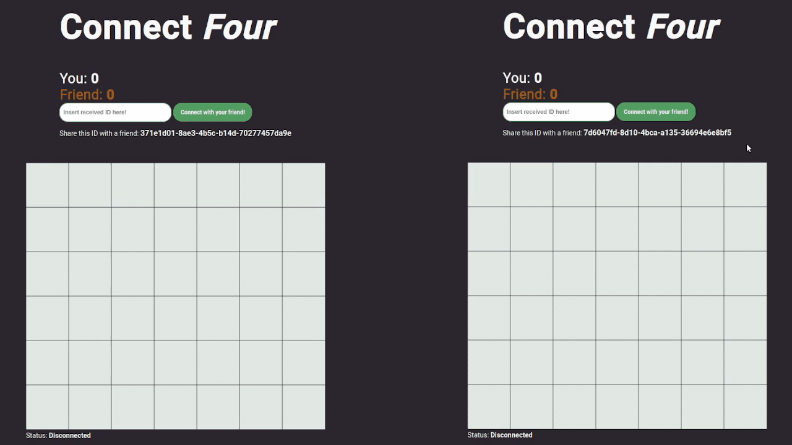

# Connect Four game
Simple connect four game to play with friends. Created with JavaScript and .NET Core for socket communication between clients and server.
## Purpose
The purpose of this project is to learn JavaScript and become more comfortable with it.
## Presentation

## Usage
1. Host contents of the frontend folder in HTTP server.
2. Run `dotnet run` inside backend folder.
